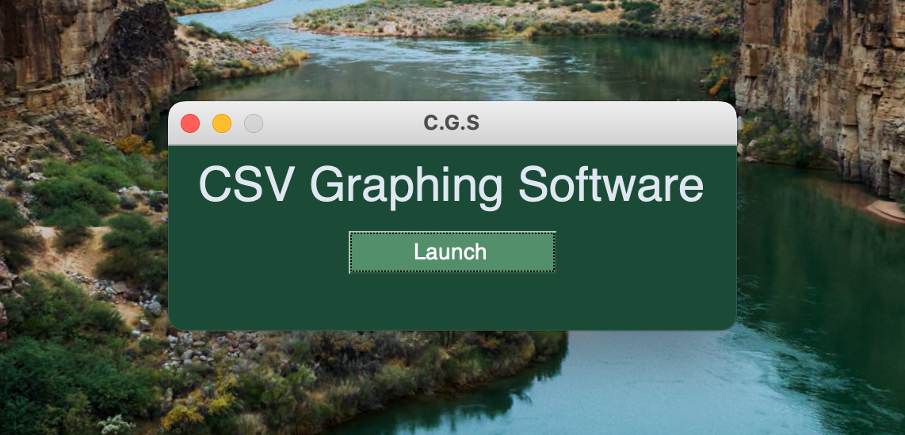
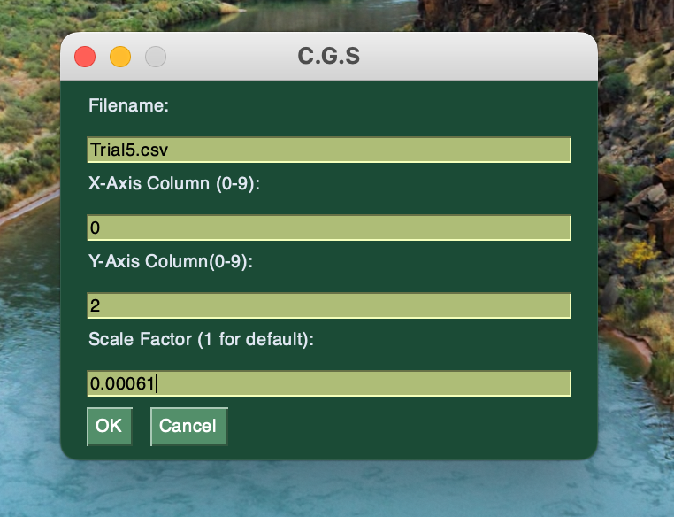
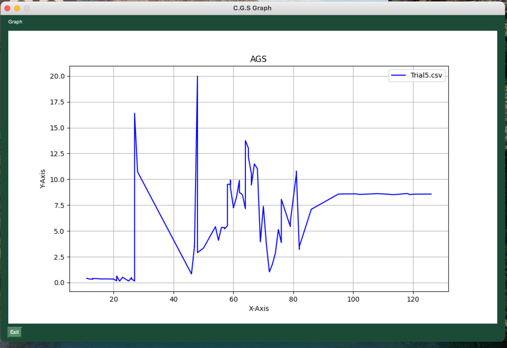

# CSV-Graphing-Software

## Instructions:

### Required Libraries: 
* PySimpleGUI
  `pip install pysimplegui`
* Numpy
  `pip install numpy`
* MatPlotLib
  `pip install numpy`

### Use Instructions:
1. Launch C-G-S.py through IDE or Terminal
   `python3 C-G-S.py`
3. Put CSV file in the same directory as C-G-S.py

#### Notes:
* Make sure that the filename includes .csv
* Currently C.G.S can only support a maximum of 10 columns. The left most column is 0 and the right most column is 9.
* Use scale factor to increase data readability. For default use 1. 

